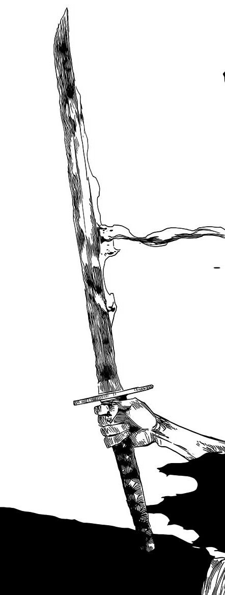

<!--
**M-Eleoterio/M-Eleoterio** is a ✨ _special_ ✨ repository because its `README.md` (this file) appears on your GitHub profile.
-->

  
<table>
  <td style="vertical-align:middle">
    
  </td>
  <td style="font-family: monospace; font-size: 80px;" width="500px" align="left">
    <pre>▸ About Eleotério</pre>
  <pre>
      ▸ Web developer
     
      ▸ <strong>BACKEND</strong>
        ⌞ <code></code> PHP
          ⌞ <code></code> Laravel 
        ⌞ <code></code> JavaScript 
          ⌞ <code></code> NodeJS
          ⌞ <code></code> Jest
     
      ▸ <strong>DATABASE</strong>
        ⌞ <code></code> MySQL
        ⌞ <code></code> PostgreSQL
     
      ▸ <strong>FRONTEND</strong>
        ⌞ <code></code> JavaScript
          ⌞ <code></code> NextJS 
        ⌞ <code></code> PHP
          ⌞ <code></code> Laravel
     
      ▸ System Dev by SENAI
      ▸ World Skills competitor
        ⌞ Stage: National
        ⌞ Category: #17 - Web Technologies
  </pre>
  </td>
  <tr></tr>
  <td style="vertical-align:middle" align="left">
    
  </td>
  <td align="left">
    
  <pre>▸ Contact</pre>
  <pre>
    ▸ <a href="mailto:m.eleoteriovieira@gmail.com" style="color: gray">m.eleoteriovieira@gmail.com</a>
    ▸ <a href="linkedin.com/in/miguel-eleotério-vieira-206112250">LinkedIn</a>
    ▸ he/him
    ▸ brazilian pt + english
  </pre>
  </td>
  <tr></tr>
  <td style="vertical-align:middle">
    
  </td>
  <td style="display:flex; align-items: center">
    

      <a href="https://github.com/m-eleoterio">
      
      
    

  </td>
</table>
        

 

  
 
 
  

